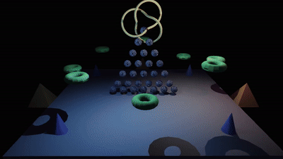

# Cortex Engine

AI-Native 3D game engine with pure P/Invoke Vulkan 1.3 render backend.



## Features

- **Vulkan 1.3** — dynamic rendering, synchronization2, pure P/Invoke (no wrapper libraries)
- **PBR Shading** — Cook-Torrance BRDF, ACES tonemapping, multi-light support
- **Cubemap Array Shadows** — omnidirectional shadows from multiple point lights, 16-tap Poisson disk PCF
- **Jolt Physics** — rigid body dynamics, box/sphere colliders, gravity
- **ImGui** — debug overlay, light/shadow/physics controls
- **AI/MCP** — 7 tools (spawn, transform, material, delete, list, world state, screenshot) via HTTP/SSE
- **Video Recording** — FFmpeg pipe, 60 FPS capture, 30 FPS output
- **ECS** — Flecs.NET with Transform, Mesh, Material, Light, Camera, RigidBody components
- **SDL3 Window** — cross-platform, Vulkan surface

## Quick Start

```bash
# Build
dotnet build CORTEX_ENGINE.sln -c Debug

# Run
./scripts/run.sh

# Run with AI/MCP server
./scripts/run.sh -- --mcp-port 5000

# Run tests
dotnet test tests/Engine.Tests/Engine.Tests.csproj -c Debug
```

## Controls

- **WASD** — move camera
- **Right-click + drag** — look around
- **Q/E** — down/up
- **Shift** — speed boost
- **ESC** — quit

## ImGui Panels

- **Cortex Engine Debug** — FPS, camera, entity count, physics toggle, reset scene
- **Shadow & Light Parameters** — per-light intensity/range/RGB, shadow bias/radius/farplane, ambient RGB
- **Video Recording** — start/stop recording to MP4

## MCP Tools

Connect via `http://localhost:5000/` (SSE):

| Tool | Description |
|---|---|
| `spawn_model` | Create object (cube/sphere, optional physics) |
| `set_transform` | Move/rotate/scale by name |
| `set_material` | Change color/roughness/metallic |
| `delete_entity` | Remove object |
| `list_entities` | List all objects |
| `get_world_state` | Full JSON state |
| `capture_screenshot` | Request screenshot |

## Requirements

- .NET 9 SDK
- Vulkan 1.3+ drivers
- SDL3 (bundled via NuGet)
- FFmpeg (for video recording)
- glslangValidator (for shader recompilation)

## Architecture

See [CORTEX_ENGINE_ARCHITECTURE.md](CORTEX_ENGINE_ARCHITECTURE.md) for full technical docs.

## License

All rights reserved.
